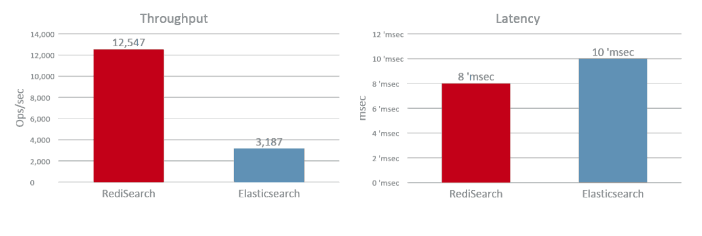
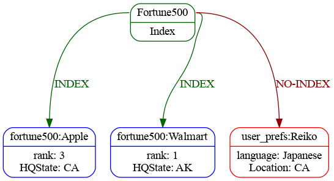
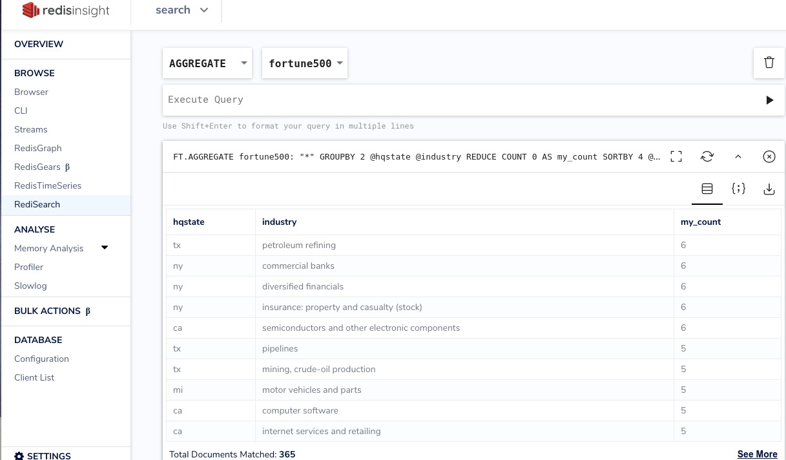
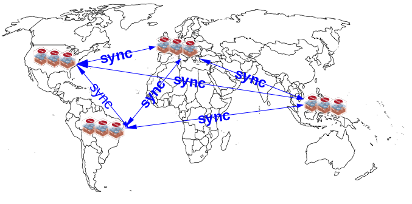

## RediSearch

---

## Agenda
<small>

* Why??
* Example Use Case
* Autocompletion
* Loading Data
* Searching
* Aggregating
* RedisLabs Extras

</small>

---

### Why Search?

|Search|RDBMS|
|--|--|
| | |
|<small> Where's my data?</small> | <small>Give me *this* data </small> |
|<small> Index data but also store </small> | <small>Store data but also index </small> |
|<small> Built for de-normalized data </small> | <small>Optimized for normalized data </small> |
|<small> AP in CAP Theorum  </small> | <small>CP in CAP Theorum </small> |
|||

---

### Why Search in Redis??

### Speed !!

---

### Why Search in Redis??

### Now !!

  
Documents are available for reading *immediately*

---

### Why Search in Redis??

### Easy !!

  
Load the RediSearch module and *go*

---

### Example Use Case

Fortune 500 Companies

- Rank
- CEO
- Sector
- Industry
- Ticker

---

### Set Up Autocompletion

<pre><code>
> FT.SUGLEN ac
0
> FT.SUGADD ac Walmart 1.0
1
> FT.SUGADD ac "Berkshire Hathaway" 1.0
2
> FT.SUGADD ac "Apple" 1.0
3
...
> FT.SUGLEN ac
500

</code></pre>

---

### Query the Autocompleter

<pre><code>
> FT.SUGGET ac birk
(empty list or set)

# No matches - Let's try Fuzzy matching
> FT.SUGGET ac birk  FUZZY
1) "Berkshire Hathaway"

</code></pre>

---

### Code Example
<pre><code>
from redisearch import AutoCompleter, Suggestion
ac = AutoCompleter(
   'ac',
   conn = client.redis
   )

if ac.len() < 1:
    load_data()

for row in csv_reader:
  ac.add_suggestions(Suggestion(row[1],  1.0))

</code></pre>

---

## Loading Data

---

### Create our Schema

<pre><code>
FT.CREATE fortune500
  ON HASH PREFIX 1 fortune500:
  LANGUAGE English 
  SCORE_FIELD title SCORE 0.5 
  SCHEMA 
    title TEXT WEIGHT 5.0
    employees NUMERIC SORTABLE

</code></pre>

---

### Schema breakdown

<pre><code>
FT.CREATE INDEX_NAME
  ON HASH PREFIX count PREFIX1 PREFIX2

</code></pre>

<pre><code>
FT.CREATE myIndex
  ON HASH PREFIX 3 end_user: admin_user: ro_user:

</code></pre>

---

### Prefixes?!?

 

<small>

- Writing applications do not have to be search aware
- Add search indices on "legacy" data
- Flexibility to add new fields or un-indexed fields

</small>

---

### Languages

<pre><code>
FT.CREATE fortune500
  ...
  LANGUAGE English 
  ...

</code></pre>

<small>

| | | | | | 
|--|--|--|--|--|
|Arabic|Danish|Dutch|English|Finnish|
|French|German|Hungarian|Italian|Norwegian|
|Portuguese|Romanian|Russian|Spanish||
|Swedish|Tamil|Turkish|Chinese||
| | | | | | 

</small>

---

### Languages - Why?

#### Stemming
 

- search going will return "going", "go", "gone"
- plurals, verb forms
- suffixes eg: ational   ation   ator:   replace by ate
- custom dictionaries are possible

---

### Scoring

<pre><code>
FT.CREATE fortune500
  ...
  SCORE_FIELD title SCORE 0.5 
  ...

</code></pre>

---

### Scoring

<pre><code>
> FT.SEARCH fortune500 "%computer%" WITHSCORES
 2) "fortune500:ComputerSciences"
 3) "2.5"
 4)  1) "rank"
     2) "379"
     3) "website"
     4) "http://www.dxc.technology"
     ...
 5) "fortune500:ActivisionBlizzard"
 6) "0.5"
 7)  1) "rank"
     2) "406"
     ...
    10) "Computer Software"

</code></pre>

---

## Searching
<small>
https://oss.redislabs.com/redisearch/Query_Syntax/
</small>

---

_Range Match_
<pre><code>
    @assets:[20000, 30000]

</code></pre>

_Negative Match_
<pre><code>
    -@hqstate:(NY|CA)

</code></pre>

_Optional Match_
<pre><code>
    ~@sector:\"Health Care\""

</code></pre>

_Fuzzy Match_
<pre><code>
    ~@ceo:%%Brian%%

</code></pre>

---

### Searching - Find Everything

<pre><code>
> FT.SEARCH fortune500 "*" LIMIT 0 1
1) (integer) 500
2) "fortune500:TollBrothers"
3)  1) "rank"
    2) "497"
    3) "website"
    4) "http://www.tollbrothers.com"
    5) "employees"
    6) "4200"
    7) "sector"
    8) "Engineering & Construction"
    9) "industry"
   ...
</code></pre>

---

### Searching - Query by field

<pre><code>
> FT.SEARCH fortune500 "@assets:[20000, 30000]
      -@hqstate:NY ~@sector:\"Health Care\"" WITHSCORES
2) "fortune500:CommunityHealthSystems"
3) "0.20000000000000001"
4)  1) "rank"
    2) "130"
    7) "sector"
    8) "Health Care"
29) "fortune500:Level3Communications"
30) "0.10000000000000001"
31)  1) "rank"
     2) "336"
     7) "sector"
     8) "Telecommunications"

</code></pre>

---

### Searching - Code

<pre><code>
from redisearch import Client, Query
client = Client('fortune500')
client.search(Query("technology").limit_fields('sector')).docs
</code></pre>

---

## Aggregations

<small>
https://oss.redislabs.com/redisearch/Aggregations/
</small>

---

#### Aggregations 
<pre><code>
> FT.AGGREGATE fortune500 "*" GROUPBY 1 @hqstate 
  REDUCE COUNT 0 AS my_count SORTBY 2 @my_count DESC LIMIT 0 2
1) (integer) 37
2) 1) "hqstate"
   2) "ny"
   3) "my_count"
   4) "54"
3) 1) "hqstate"
   2) "ca"
   3) "my_count"
   4) "53"

</code></pre>

---

#### Aggregations  with functions
<pre><code>
> FT.AGGREGATE fortune500 "*" APPLY "upper(@hqstate)" AS state
 GROUPBY 1 @state REDUCE COUNT 0 AS my_count 
 SORTBY 2 @my_count DESC LIMIT 0 2
 1) (integer) 37
2) 1) "state"
   2) "NY"
   3) "my_count"
   4) "54"
3) 1) "state"
   2) "CA"
   3) "my_count"
   4) "53"

</code></pre>

---

#### Aggregations  with functions
<pre><code>
from redisearch import Client, aggregation, reducers
client = Client('fortune500')
ar = aggregation.AggregateRequest().
  group_by("@hqcity", reducers.count().alias('my_count')).
  sort_by(aggregation.Desc('@my_count'))
client.aggregate(ar).rows

</code></pre>

---

## RedisLabs Extras

---

### Redis Insight

https://redislabs.com/redisinsight/

Free!

---

#### Redis Insight Integrations - Search
 

---

#### Redis Enterprise Active/Active
 

<small>

* Based off of CRDTs
* Used for
  * Disaster Recovery
  * Data Migration
  * Enhanced Uptime

</small>

---

## Thank you